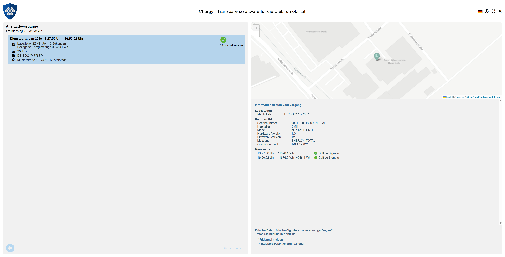

# Chargy WebApp

Chargy is a transparency software library for the validation of secure and transparent e-mobility charging processes, as defined by the *German Calibration Law ("Eichrecht")* in combination with the [Alternative Fuels Infrastructure Regulation (AFIR)](https://transport.ec.europa.eu/transport-themes/clean-transport/alternative-fuels-sustainable-mobility-europe/alternative-fuels-infrastructure_en) and the new [Measuring instruments (MID-11)](https://single-market-economy.ec.europa.eu/single-market/goods/european-standards/harmonised-standards/measuring-instruments-mid_en) of the European Commission and the [European Digital Quality Infrastructure](https://www.qi-digital.de/en/). The software allows you to verify the cryptographic signatures of energy measurements within charge detail records and comes with a couple of useful extentions to simplify the entire process for endusers and operators.

<kbd>
  
</kbd>

You can test the Chargy WebApp at: [https://chargy.charging.cloud](https://chargy.charging.cloud)


## Benefits of Chargy

1. Chargy comes with __*meta data*__. True charging transparency is more than just signed smart meter values. Chargy allows you to group multiple signed smart meter values to entire charging sessions and to add additional meta data like EVSE information, geo coordinates, tariffs, ... within your backend in order to improve the user experience for the ev drivers.
2. Chargy is __*secure*__. Chargy implements a public key infrastructure for managing certificates of smart meters, EVSEs, charging stations, charging station operators and e-mobility providers. By this the ev driver will always retrieve the correct public key to verify a charging process automatically and without complicated manual lookups in external databases.
3. Chargy is __*Open Source*__. In contrast to other vendors in e-mobility, we belief that true transparency is only trustworthy if the entire process and the required software is open and reusable under a fair copyleft license (AGPL).
4. Chargy is __*open for your contributions*__. We currently support adapters for the protocols of different charging station vendors like chargeIT mobility, ABL (OCMF), chargepoint. The certification at the Physikalisch-Technische Bundesanstalt (PTB) is provided by chargeIT mobility. If you want to add your protocol or a protocol adapter feel free to read the contributor license agreement and to send us a pull request.
5. Chargy is __*white label*__. If you are a supporter of the Chargy project you can even use the entire software project under the free Apache 2.0 license. This allows you to create proprietary forks implementing your own corporate design or to include Chargy as a library within your existing application (This limitation was introduced to avoid discussions with too many black sheeps in the e-mobility market. We are sorry...).
6. Chargy is __*accessible*__. For public sector bodies Chargy fully supports the [EU directive 2016/2102](https://eur-lex.europa.eu/legal-content/EN/TXT/PDF/?uri=CELEX:32016L2102) on the accessibility of websites and mobile applications and provides a context-sensitive feedback-mechanism and methods for dispute resolution.


## Supported Charge Transparency Data Formats

Currently supported formats include:

- **Alfen** charge transparency data
- **Bauer** energy meter data (2 format variants)
- **ChargePoint** transparency data (2 format variants)
- **EDL40** and **ISA-EDL40 SML** data
- **EMH** energy meter data
- **Mennekes** XML
- **OCMF**, versions v1.1 to v1.4
  - Bonner Eichrechtstage **Tariff Text** Extensions
  - EdDSA support: Ed25519 and Ed448
  - Post-Quantum Cryptography support: ML-DSA-44, ML-DSA-65, ML-DSA-87
- **Porsche Charging Data Format (PCDF)**

Supported representations include:

- **Plain Files** containing a single charge transparency data set.
- **chargeIT Container Format**, a JSON-based container format for a single charging session (2 format variants).
- **Chargy Container Format**, a JSON-based container format for multiple charging sessions.
- **SAFE XML Container Format**, an XML-based container format for a single charging session, optionally enriched with additional Chargy metadata about the charging session.
- **PTB Container Format**, a JSON-based container format for a single charging session.
- **Archive formats** such as ***tar, ZIP, tar.gz***, and similar formats that combine or compress multiple charge transparency files.
- **QR-Code images**, such as ***PNG, JPG, JPEG or SVG files***, where the QR-Code represents a charge transparency data set.
- **PDF/A-3** files transporting a charge transparency file as an embedded additional data stream.


## Editions, Versions and Milestones

Version 1.2.x of the Chargy Transparency Software (Desktop) was reviewed and certified by [Verband der Elektrotechnik Elektronik Informationstechnik e.V. (VDE)](https://www.vde.com/de). If you are a charge point vendor and want to use this software to verify the compliance with the German Eichrecht you can talk to our partner [ChargePoint](https://www.chargepoint.com/de-de/) and obtain the required legal documents.

Version 1.0.x of the Chargy Transparency Software (Desktop) was reviewed and certified by [Physikalisch-Technische Bundesanstalt (PTB)](https://www.ptb.de). If you are a charge point vendor and want to use this software to verify the compliance with the German Eichrecht you can talk to our partner [chargeIT mobility](https://www.chargeit-mobility.com) and obtain the required legal documents.

If you need help with the Chargy Transparency Software or want to include your smarty energy meter or transparency data format, talk to [us](https://open.charging.cloud).

This software is also available as [DesktopApp](https://github.com/OpenChargingCloud/ChargyDesktopApp).


## Installation

Assuming you have a current Node.js (~v21.7) installation you can just clone this git repository, install all the JavaScript dependencies, compile it and run the webpack development server...

```
git clone https://github.com/OpenChargingCloud/ChargyWebApp.git
cd ChargyWebApp
npm install
npm run build
npm start
```

Your prefered web browser should automagically open http://localhost:1608

For Linux production deployments, build the static web application and serve the generated `build/` directory with a web server such as nginx. See [Chargy WebApp on Linux](documentation/LinuxService.md).


## Deep Links

The hosted WebApp supports deep links for CPOs and backend systems that want to send customers directly to a verification result.

### Inline payloads

Small charge transparency records can be embedded directly in the URL via the `verify` query parameter:

```
https://chargy.charging.cloud?verify=<unpadded-base64url-encoded-data>
```

The `verify` value **must use unpadded Base64URL encoding** as defined by RFC 4648 section 5. Standard Base64 is not accepted: use `-` and `_` instead of `+` and `/`, and omit trailing `=` padding. The payload is decoded by the browser and then processed like data received via drag and drop or clipboard paste.

This variant should only be used for small text payloads such as compact JSON, XML or OCMF data. Large payloads are not recommended because URL size limits vary between browsers, proxies, mail clients and QR-code workflows. As a practical rule of thumb, keep the full URL below a few kilobytes whenever possible.

### External payload URLs

Larger payloads can be referenced via `verifyURL`:

```
https://chargy.charging.cloud?verifyURL=https%3A%2F%2Fapi.example.org%2Fctrs%2F12345.json
```

The `verifyURL` must reference a concrete charge transparency payload resource, not a directory or collection URL.

An optional temporary access token can be provided with the `token` query parameter:

```
https://chargy.charging.cloud?verifyURL=https%3A%2F%2Fapi.example.org%2Fctrs%2F12345.json&token=<temporary-token>
```

The WebApp appends this token to the downloaded URL as its own `token` query parameter. If the target URL already contains a query string, the token is merged into it:

```
https://api.example.org/ctrs/12345.json?format=chargy
```

becomes:

```
https://api.example.org/ctrs/12345.json?format=chargy&token=<temporary-token>
```

Alternatively, or in addition, a bearer token can be provided with the `bearerToken` query parameter:

```
https://chargy.charging.cloud?verifyURL=https%3A%2F%2Fapi.example.org%2Fctrs%2F12345.json%3Fformat%3Dchargy&bearerToken=<temporary-token>
```

This token is sent as an HTTP authorization header when downloading the payload:

```
Authorization: Bearer <temporary-token>
```

The `token` and `bearerToken` parameters may be used at the same time, even if that is redundant.

The WebApp will only download external payloads from URL prefixes explicitly allowed by a local `externalURLs.conf` file served next to `index.html`.

The file format is one rule per line:

```
# <URL-prefix> <max-payload-size-in-kbytes>
https://api.example.org/ctrs/ 100
```

Blank lines and lines starting with `#` are ignored. The requested `verifyURL` must start with one of the configured URL prefixes. Redirects are only accepted when the final URL still starts with the same allowed prefix.

The size limit is enforced twice:

- If the server sends a `Content-Length` header larger than the configured limit, the download is rejected before reading the body.
- If the response is streamed without a usable `Content-Length`, the WebApp counts bytes while reading and aborts as soon as the configured limit is exceeded.

The generated build includes an empty template at `build/externalURLs.conf`. Production deployments should replace or extend this file with the allowed API prefixes.

### CORS

Because `verifyURL` downloads are performed by the user's browser, the target API must allow cross-origin requests from the WebApp origin. For the public deployment this means allowing:

```
Access-Control-Allow-Origin: https://chargy.charging.cloud
```

When `bearerToken` is used, the target API must also allow the `Authorization` request header, for example:

```
Access-Control-Allow-Headers: Authorization
```

The WebApp fetches external payloads without credentials, so APIs should not require cookies or browser authentication for these verification payload URLs. Prefer short-lived, unguessable URLs or backend-issued tokens when payloads are not public.

Tokens passed in URLs can appear in browser history, server logs and referrer logs. They should therefore be short-lived, scoped to a single payload and invalidated after use whenever possible.


## Future

The development of version **v2.x** already started and will focus on enhanced security concepts, more digital certificates and pricing information.


## Credits

- <a href="https://github.com/sirhcel">Christian Meusel</a> for more BSM validations.


## Funding

This Open Source project is partially funded by the [NGI Zero Commons Fund](https://nlnet.nl/commonsfund/) as part of our [EVQI project](https://nlnet.nl/project/EVQI/).

We also appreciate any additional funding and long-term support for the Chargy family, for example via [GitHub Sponsors](https://github.com/sponsors/GraphDefined), as it helps us keep the project sustainable, independent and useful for the entire e-mobility community.

<center>
  
</center>


## Awards

The Chargy Transparency Software is one of the winners of the [1. Thuringia's Open-Source Prize](https://www.it-leistungsschau.de/programm/TOSP2019/) </a> in March 2019. This prize was awarded by [Wolfgang Tiefensee](https://de.wikipedia.org/wiki/Wolfgang_Tiefensee), [Thuringia’s Secretary of Commerce](https://www.thueringen.de/th6/tmwwdg/), in conjunction with the board of directors of the IT industry network [ITNet Thuringia](https://www.itnet-th.de).

<center>
   
</center>
